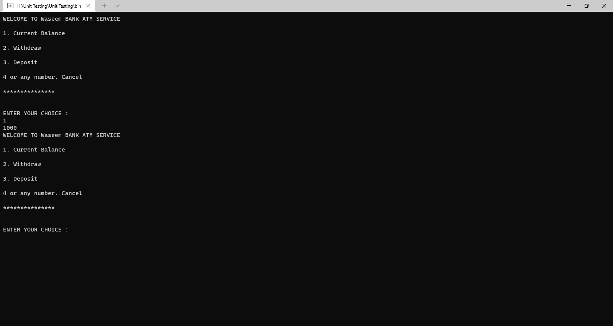
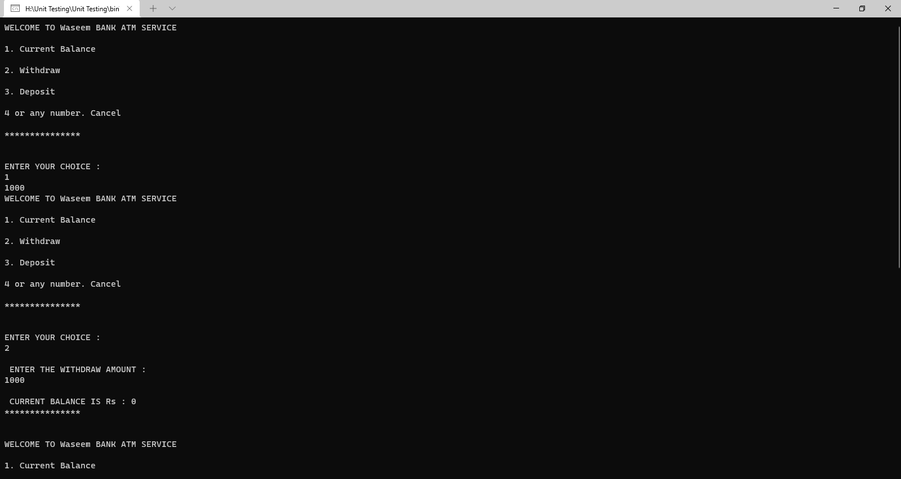
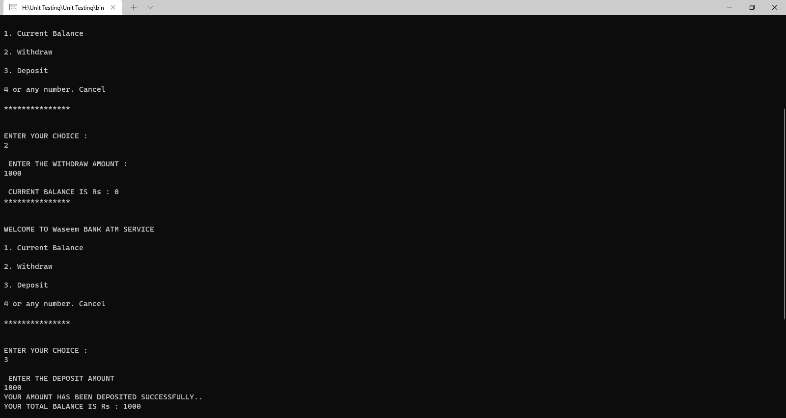
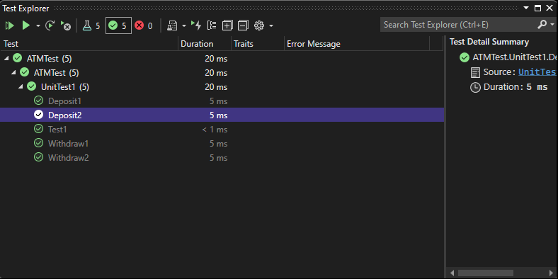

# BANK ATM SERVICE
This is an ATM working simulation system from:
1. Show Current Balance
2. Use Withdraw
3. Use Deposit

---------------------------------------------------------------------

## 1. The first step choise 1 to show the Current Balance
## 2. Then choise 2 to Withdraw
## 3. the last step choise 3 Deposit 
## 4.After any operation show the  Current Balance

==============================================================
to uxtest

